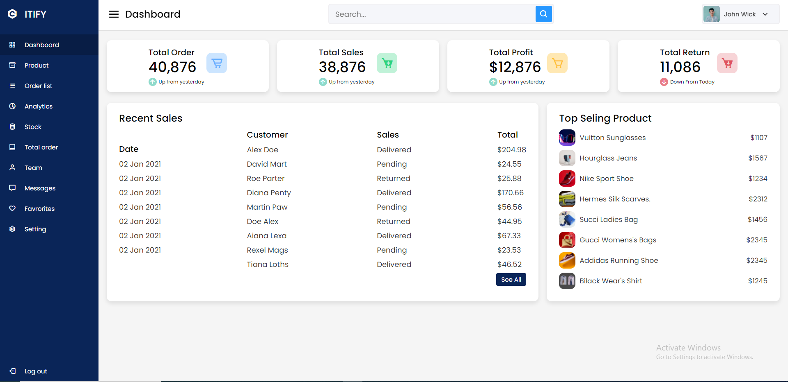

# GITHUB INDICATORS

  # Responsive-Admin-Panel

Hello, welcome to this lesson. Today I create with html, css and js file for Responsive-Admin-Panel. I use here html, css and js tags. 
## ## RULES OF USE

> **STEP-1:** `https://github.com/cavidsuleyman/Responsive-Admin-Panel.git`  
> **STEP-2:**  enter the `Responsive-Admin-Panel` folder that appears  
> **STEP-3:**  open the folder you are in in a text editor  
> **STEP-4:**  run the  all the`index.html` files in the main folder  
> **STEP-5:**  to download the project as `.zip`  [here](https://github.com/cavidsuleyman/Responsive-Admin-Panel/archive/refs/heads/master.zip) click  

## Technology

This project was developed using the following technologies

| No | Technique | Purpose |
| - | ---------- | --------------------- |
| 1 | HTML | Building a project skeleton |
| 2 | CSS |  Make-up of the established skeleton |
| 3 | GIT |  Project version control management |
| 4 | JS | Dynamic operations |
| 5 | VSCode | Text editor used in the project |

## SAMPLE SCREEN APPEARANCE

 
